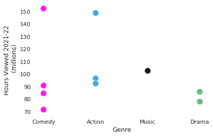

# Microsoft Movie Studio Proposal


**Authors**: Juan Acosta, Holly Gultiano, and Jon McCaffrey

## Overview

Our project presents current trends in the film market. Using exploratory and expository data analysis techniques in Python, we are able to give Microsoft Movie Studio recommendations on the most popular and profitable genres of film, and how Microsoft could use its own intellectual property to expand into the growing market of video game inspired movies.  

## Business Challenge

Microsoft is starting a movie studio (in this hypothetical example) and are looking to make significant impact as soon as possible in this sector. Our group's aim is to give actionable direction for them to go  with this project, driven by real world data from the film industry. These included such data as viewer statitics and revenue, since they are the strongest indicators of success in the entertainment industry.

## Data

Our sources of data included IMDB, Box Office Mojo, The Movie Database, and Netflix. The variables we found to be most useful are box office revenue, genre IDs, user ratings, total viewer counts, and hours watched for streaming content. To assess the current market trends for digital releases (streaming) compared to those of the box office, we used summary reports from the Motion Pictures Association, retrieved from https://www.mpa-apac.org/wp-content/uploads/2019/03/MPAA-THEME-Report-2018.pdf, and https://www.motionpictures.org/wp-content/uploads/2022/03/MPA-2021-THEME-Report-FINAL.pdf . Video game movie data was sourced from Kaggle https://www.kaggle.com/datasets/bcruise/film-adaptations-of-video-games?select=video_game_films.csv . For numeric variables, we use summed totals and statistical measures such as averages, and categorical data was cleaned and organized to make it smoothly operable with the numerical data.


## Methods


Data exploration and descriptive analysis was performed in Python and SQLite, using the Pandas data analysis and manipulation library, and the Matplotlib/Seaborn libraries to make plots. This was in order to isolate, clean, and organize select variables, correlating them to the most popular and profitable films to produce.


## Results

Our analysis suggests the most impactful genres over all datasets spanning a wide time range were Action-Adventure and Drama. Using very recent data from streaming film statistics, we note that the current trends indicate a shift towards an increase in demand for Comedy films. As people's preference for movie viewing has shifted more towards streaming at home and on mobile devices, the trend for Comedy preference could be interpreted as translating better to small-screen viewing, as opposed to Action-Adventure films being more suited to big screen theatrical releases due to their highly sensory nature. 
One striking and relevant indication we discovered is the strong box office return for movies based on video game franchises. This seems like a natural outlet for Microsoft, given the large quantity of popular video game titles in Microsoft's product library.


### Visuals of Produced Graphs





## Conclusions

Based on the consistent high performance of Action-Adventure and Drama films over time, and knowing the high returns on previous video game films, Microsoft should consider basing their initial movie studio production in their well regarded video game titles corresponding to these genres. The possible shift towards an interest in comedy is something to be further explored, and incorporated in order to be ahead of the curve on changes in viewership trends. Future predictive analysis beyond the scope of our project would be advised in this area, as our streaming data only spanned one year's time. There is also an untapped potential of utilizing Microsoft's knowledge and technology base in VR/AR to further enhance movie viewer immersion, as well as blending patronage across product market bases. 


## For More Information

Please review our full analysis in [our Jupyter Notebook](./MS_Movie_Studio_Project.ipynb) or our [presentation](./DS_Project_Presentation.pdf).

For any additional questions, please contact **Juan Acosta jmaa3108@gmail.com, Holly Gultiano akoholographics@gmail.com, Jon McCaffrey jonmccaffrey524@gmail.com**

## Repository Structure

Describe the structure of your repository and its contents, for example:

```
├── README.md                           <- The top-level README for reviewers of this project
├── MS_Move_Studio_Project.ipynb   	<- Main notebook for project code
├── DS_Project_Presentation.pdf         <- PDF of slides for our presentation
├── zippedData                          <- Both sourced externally and generated from code
├── Notes				<- Working notebooks for each member of the authors of this project
└── Images                              <- images used and generated in the project
```
